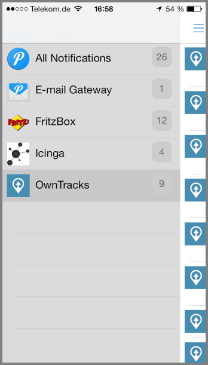

# mqttwarn

This program subscribes to any number of MQTT topics (which may include wildcards) and publishes received payloads to one or more notification services, including support for notifying more than one distinct service for the same message.

For example, you may wish to notify via e-mail and to Pushover of an alarm published as text to the MQTT topic `home/monitoring/+`.

Support for the following services is available:

* files (output to files on the file system)
* Pushover.net
* Twitter
* SMTP (e-mail)
* NMA
* Prowl
* XBMC
* Mac OS X notification center

Notifications are transmitted to the appropriate service via plugins. We provide plugins for the above list of services, and you can easily add your own.

In addition to passing the payload received via MQTT to a service, _mqttwarn_ allows you do do the following:

* Transform payloads on a per/topic basis. For example, you know you'll be receiving JSON, but you want to warn with a nicely formatted message.
* For certain services, you can change the _title_ (or _subject_) of the outgoing message.

Consider the following JSON payload published to the MQTT broker:

```shell
mosquitto_pub -t 'osx/json' -m '{"fruit":"banana", "price": 63, "tst" : "1391779336"}'
```

Using the `formatmap` we can configure _mqttwarn_ to transform that JSON into a different outgoing message which is the text that is actually notified. Part of said `formatmap` looks like this in the configuration file:

```python
formatmap = {
'osx/json'          :  "I'll have a {fruit} if it costs {price}",
}
```

The result is:


You associate MQTT topic branches to applications in the configuration file (copy `mqttwarn.conf.sample` to `mqttwarn.conf` for use). In other words, you can accomplish, say, following mappings:

* PUBs to `owntracks/jane/iphone` should be notified via Pushover to John's phone
* PUBs to `openhab/temperature` should be Tweeted
* PUBs to `home/monitoring/alert/+` should notify Twitter, Mail, and Prowl

See details in the config sample for how to configure this script.
The path to the configuration file (which must be valid Python) is obtained from the `MQTTWARNCONF` environment variable which defaults to `mqttwarn.conf` in the current directory.

## Obligatory screenshot



## Requirements

You'll need at least the following components:

* Python 2.x (tested with 2.6 and 2.7)
* An MQTT broker (e.g. [Mosquitto](http://mosquitto.org))
* The Paho Python module: `pip install paho-mqtt`

Depending on the notification services you wish to use, you'll also require one
or more of the following:

* A [pushover.net](https://pushover.net/) account
* A [Twitter](https://twitter.com) account with application keys
* NMA FIXME
* Prowl FIXME
* XBMC FIXME
* Mac OS X notification center: a Mac ;-) and [pync](https://github.com/setem/pync) which uses the binary [terminal-notifier](https://github.com/alloy/terminal-notifier) created by Eloy Durán. Note: upon first launch, `pync` will download and extract `https://github.com/downloads/alloy/terminal-notifier/terminal-notifier_1.4.2.zip` into a directory `vendor/`.


## Installation

1. Clone this repository into a fresh directory.
2. Copy `mqttwarn.conf.sample` to `mqttwarn.conf` and edit to your taste
3. Install the prerequisite Python modules for the services you want to use
4. Launch `mqttwarn.py`

I recommend you use [Supervisor](http://jpmens.net/2014/02/13/in-my-toolbox-supervisord/) for running this.
