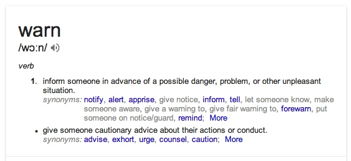
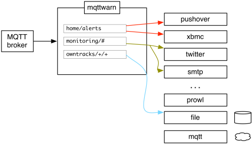
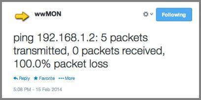

# mqttwarn

To _warn_, _alert_, or _notify_.



This program subscribes to any number of MQTT topics (which may include wildcards) and publishes received payloads to one or more notification services, including support for notifying more than one distinct service for the same message.

For example, you may wish to notify via e-mail and to Pushover of an alarm published as text to the MQTT topic `home/monitoring/+`.

_mqttwarn_ supports a number of services (listed alphabetically below), including output to
_files_, publishing to _MQTT_, HTTP GET and POST requests, _NMA_, _Pushbullet_, _Pushover_, _Twilio_, _Twitter_, SMTP, _Prowl_, Redis PUB, _XBMC_, etc.



Notifications are transmitted to the appropriate service via plugins. We provide plugins for the above list of services, and you can easily add your own.


## Getting started

I recommend you start off with the following simple configuration which will log messages received on the MQTT topic `test/+` to a file. Create the following configuration file:

```python
import logging
loglevel = logging.DEBUG
logformat = '%(asctime)-15s %(module)s %(message)s'

broker = 'localhost'
port = 1883

services = [ 'file' ]

file_config  = {
    'append_newline'   : True,
}
file_targets = {
    'mylog'	: ['/tmp/mqtt.log'],
}

topicmap = {
    'test/+'   : ['file:mylog'],
}
```

Launch `mqttwarn.py` and keep an eye on its log file (`mqttwarn.log` by default). Publish two messages to the subscribed topic, using

```
mosquitto_pub -t test/1 -m "Hello"
mosquitto_pub -t test/name -m '{ "name" : "Jane" }'
```

and our output file `/tmp/mqtt.log` should contain the payload of both messages:

```shell
cat /tmp/mqtt.log
Hello
{ "name" : "Jane" }
```

Both payloads where copied verbatim to the target.

Stop _mqttwarn_, and add the following to its configuration file:

```python
formatmap = {
    'test/name'                 :  '-->{name}<--',
}
```

_mqttwarn_ is configured to subscribe to `test/+`, so it will also receive publishes to `test/name`. What we are configuring _mqttwarn_ to do here, is to try and decode the incoming JSON payload and format the output in such a way as that the JSON `name` element is copied to the output (surrounded with a bit of sugar to illustrate the fact that we can output whatever text we want).

If you repeat the publish of the second message, you should see the following in your output file `/tmp/mqtt.log`:

```
-->Jane<--
```

## Transformation

In addition to passing the payload received via MQTT to a service, _mqttwarn_ allows you do do the following:

* Transform payloads on a per/topic basis. For example, you know you'll be receiving JSON, but you want to warn with a nicely formatted message.
* For certain services, you can change the _title_ (or _subject_) of the outgoing message.

Consider the following JSON payload published to the MQTT broker:

```shell
mosquitto_pub -t 'osx/json' -m '{"fruit":"banana", "price": 63, "tst" : "1391779336"}'
```

Using the `formatmap` we can configure _mqttwarn_ to transform that JSON into a different outgoing message which is the text that is actually notified. Part of said `formatmap` looks like this in the configuration file, and basically specifies that messages published to `osx/json` should be transformed as on the right-hand side.

```python
formatmap = {
'osx/json'          :  "I'll have a {fruit} if it costs {price}",
}
```

The result is:


You associate MQTT topic branches to applications in the configuration file (copy `mqttwarn.conf.sample` to `mqttwarn.conf` for use). In other words, you can accomplish, say, following mappings:

* PUBs to `owntracks/jane/iphone` should be notified via Pushover to John's phone
* PUBs to `openhab/temperature` should be Tweeted
* PUBs to `home/monitoring/alert/+` should notify Twitter, Mail, and Prowl

See details in the config sample for how to configure this script.
The path to the configuration file (which must be valid Python) is obtained from the `MQTTWARNCONF` environment variable which defaults to `mqttwarn.conf` in the current directory.


## Configuration of service plugins

Service plugins are configured in the main `mqttwarn.conf` file. Each service has two mandatory _dict_s:

* `service_config` defines things like connection settings for a service, even though many don't need that. Even so, the _dict_ must be defined (e.g. to `None`).
* `service_targets` defines the notification "targets" we use to associate an incoming MQTT topic with the output (i.e. notificiation) to a service.

We term the array for each target an "address list" for the particular service. These may be path names (in the case of the `file` service), topic names (for outgoing `mqtt` publishes), hostname/port number combinations for `xbmc`, etc.

### `file`

The `file` service can be used for logging incoming topics, archiving, etc. Each message is written to a path specified in the targets list. Note that files are opened for appending and then closed on each notification.

Supposing we wish to archive all incoming messages to the branch `arch/#` to a file `/data/arch`, we could configure the following:

```python
file_config  = {
    'append_newline'   : True,
}
file_targets = {
    'log-me'    : ['/data/arch'],
}
topicmap = {
        'arch/#'   : ['file:log-me'],
}
```

### `http`

The `http` service allows GET and POST requests to an HTTP service.

Each target has four parameters:

1. The HTTP method (one of `get` or `post`)
2. The URL, which is transformed if possible (transformation errors are ignored)
3. `None` or a dict of parameters. Each parameter value is transformed.
4. `None` or a list of username/password e.g. `( 'username', 'password')`

```python
http_config = {
    'timeout' : 60,
}
http_targets = {
                #method     #URL               # query params or None          # list auth
  'get1'    : [ "get",  "http://example.org?", { 'q': '{name}', 'isod' : '{_dtiso}', 'xx': 'yy' }, ('username', 'password') ],
  'post1    : [ "post", "http://example.net", { 'q': '{name}', 'isod' : '{_dtiso}', 'xx': 'yy' }, None ],
}
```

Note that transforms in parameters must be quoted strings:

* Wrong: `'q' : {name}`
* Correct: `'q' : '{name}'`

### `mqtt`

The `mqtt` service fires off a publish on a topic, creating a new connection to the configured broker for each message.

Consider the following configuration snippets:

```python
topicmap = {
  'in/a1'  : ['mqtt:o1', 'mqtt:o2'],
}

mqtt_targets = {
  'o1'    : [ 'out/food' ],
  'o2'    : [ 'out/fruit/{fruit}' ],
}

formatmap = {
  'in/a1'  :  u'Since when does a {fruit} cost {price}?',
}

```

The `topicmap` specifies we should subscribe to `in/a1` and republish to two MQTT targets.
The second target (`mqtt:o2`) has a topic branch with a variable in it which is to be
interpolated (`{fruit}`).

These are the results for appropriate publishes:

```
$ mosquitto_pub -t 'in/a1' -m '{"fruit":"pineapple", "price": 131, "tst" : "1391779336"}'

in/a1 {"fruit":"pineapple", "price": 131, "tst" : "1391779336"}
out/food Since when does a pineapple cost 131?
out/fruit/pineapple Since when does a pineapple cost 131?


$ mosquitto_pub -t 'in/a1' -m 'temperature: 12'

in/a1 temperature: 12
out/food temperature: 12
out/fruit/{fruit} temperature: 12
```

In the first case, the JSON payload was decoded and the _fruit_ variable could be
interpolated into the topic name of the outgoing publish, whereas the latter shows
the outgoing topic branch without interpolated values, because they simply didn't
exist in the original incoming payload.

### `mqttpub`

This service publishes a message to the broker _mqttwarn_ is connected to. (To
publish a message to a _different_ broker, see `mqtt`.)

Each target requires a topic name, the desired _qos_ and a _retain_ flag.

```python
mqttpub_config = None           # This service requires no configuration
mqttpub_targets = {
               # topic            qos     retain
    'mout1'  : [ 'mout/1',         0,     False ],
}
```

### `nma`

```python
nma_config = None
nma_targets = {
                 # api key                                            app         event
  'myapp'    : [ 'xxxxxxxxxxxxxxxxxxxxxxxxxxxxxxxxxxxxxxxxxxxxxxxx', "Nagios",  "Phone call" ],
}
```


Requires:

* A [Notify My Android(NMA)](http://www.notifymyandroid.com) account
* [pynma](https://github.com/uskr/pynma)

### `osxnotify`

* Requires Mac ;-) and [pync](https://github.com/setem/pync) which uses the binary [terminal-notifier](https://github.com/alloy/terminal-notifier) created by Eloy Durán. Note: upon first launch, `pync` will download and extract `https://github.com/downloads/alloy/terminal-notifier/terminal-notifier_1.4.2.zip` into a directory `vendor/`.


### `prowl`

This service is for [Prowl](http://www.prowlapp.com). Each target requires
an application key and an application name.

```python
prowl_config = None             # This service requires no configuration
prowl_targets = {
                    # application key                           # app name
    'pjpm'    :  [ 'xxxxxxxxxxxxxxxxxxxxxxxxxxxxxxxxxxxxxxxx', 'SuperAPP' ],
}
```


* Requires [prowlpy](https://github.com/jacobb/prowlpy)

### `pushbullet`

This service is for [PushBullet](https://www.pushbullet.com), an app for Android along with an extension for Chrome, which allows notes, links, pictures, addresses and files to be sent between devices. 

You can get your API key from [here](https://www.pushbullet.com/settings) after signing up for a PushBullet account. You will also need the device ID to push the notifications to. To obtain this you need  to follow the instructions at [pyPushBullet](https://github.com/Azelphur/pyPushBullet) and run ``./pushbullet_cmd.py YOUR_API_KEY_HERE getdevices``.

```python
# Pushbullet
pushbullet_config = None
pushbullet_targets = {
                   # API KEY                  device ID
    'warnme'   : [ 'xxxxxxxxxxxxxxxxxxxxxxx', 'yyyyyy' ],
}
```


Requires:
* a [Pushbullet](https://www.pushbullet.com) account with API key
* [pyPushBullet](https://github.com/Azelphur/pyPushBullet)

### `pushover`

This service is for [Pushover](https://pushover.net), an app for iOS and Android.
In order to receive pushover notifications you need what is called a _user key_
and one or more _application keys_ which you configure in the targets definition:

```python
pushover_config  = None    # This service requires no configuration
pushover_targets = {
    'nagios'     : ['userkey1', 'appkey1'],
    'alerts'     : ['userkey2', 'appkey2'],
    'tracking'   : ['userkey1', 'appkey2'],
    'extraphone' : ['userkey2', 'appkey3'],
}
```

This defines four targets (`nagios`, `alerts`, etc.) which are directed to the
configured _user key_ and _app key_ combinations. This in turn enables you to
notify, say, one or more of your devices as well as one for your spouse.


* Requires: a [pushover.net](https://pushover.net/) account

### `redispub`

The `redispub` plugin publishes to a Redis channel.

```python
redispub_config = {
    'host'    : 'localhost',
    'port'    : 6379,
}
redispub_targets = {
    'r1'      : [ 'channel-1' ],
}
```

* Requires Python [redis-py](https://github.com/andymccurdy/redis-py)

### `sqlite`

The `sqlite` plugin creates the a table in the database file specified in the targets,
and creates a schema with a single column called `payload` of type `TEXT`. _mqttwarn_
commits messages routed to such a target immediately.

```python
sqlite_config = None        # This plugin requires no configuration
sqlite_targets = {
                   #path        #tablename
  'demotable' : [ '/tmp/m.db',  'mqttwarn'  ],
}
```

### `smtp`

The `smtp` service basically implements an MQTT to SMTP gateway which needs
configuration.

```python
smtp_config = {
    'server'    : 'localhost:25',
    'sender'    : "MQTTwarn <jpm@localhost>",
    'username'  : None,
    'password'  : None,
    'starttls'  : False,
}
smtp_targets = {
    'localj'     : [ 'jpm@localhost' ],
    'special'    : [ 'ben@gmail', 'suzie@example.net' ],
}
```

Targets may contain more than one recipient, in which case all specified
recipients get the message.

### `twilio`

```python
twilio_config = None  # This plugin requires no configuration
twilio_targets = {
             # Account SID            Auth Token            from              to
   'hola'  : [ 'ACXXXXXXXXXXXXXXXXX', 'YYYYYYYYYYYYYYYYYY', "+15105551234",  "+12125551234" ],
}
```


Requires:
 * a Twilio account
 * [twilio-python](https://github.com/twilio/twilio-python)

### `twitter`

Notification of one or more [Twitter](http://twitter.com) accounts requires setting
up an application at [apps.twitter.com](https://apps.twitter.com). For each Twitter
account, you need four (4) bits which are named as shown below.

Upon configuring this service's targets, make sure the four (4) elements of the
list are in the order specified!

```python
twitter_config        = None                # This service requires no configuration
twitter_targets = {
  'janejol'   :  [ 'vvvvvvvvvvvvvvvvvvvvvv',                              # consumer_key
                   'wwwwwwwwwwwwwwwwwwwwwwwwwwwwwwwwwwwwwwwwww',          # consumer_secret
                   'xxxxxxxxxxxxxxxxxxxxxxxxxxxxxxxxxxxxxxxxxxxxxxxxxx',  # access_token_key
                   'zzzzzzzzzzzzzzzzzzzzzzzzzzzzzzzzzzzzzzzzzz'           # access_token_secret
                  ],
}
```



Requires:

* A Twitter account
* app keys for Twitter, from [apps.twitter.com](https://apps.twitter.com)
* [python-twitter](https://github.com/bear/python-twitter)

### `xbmc`

This service allows for on-screen notification popups on [XBMC](http://xbmc.org/) instances. Each target requires
the address and port of the XBMC instance (<hostname>:<port>).

```python
xbmc_config = None             # This service requires no configuration
xbmc_targets = {
    'living_room'    :  '192.168.1.40:8080',
    'bedroom'        :  '192.168.1.41:8080'
}
```

## Plugins

Creating new plugins is rather easy, and I recommend you take the `file` plugin
and start from that.

Plugins are invoked with two arguments (`srv` and `item`). `srv` is an object
with some helper functions, and `item` a dict which contains information on the message
which is to be handled by the plugin. `item` contains the following elements:

```python
item = {
    'service'       : 'string',       # name of handling service (`twitter`, `file`, ..)
    'target'        : 'string',       # name of target (`o1`, `janejol`) in service
    'config'        : dict,           # None or dict from SERVICE_config {}
    'topic'         : 'string',       # incoming topic branch name
    'payload'       : <payload>       # raw message payload
    'message'       : 'string',       # formatted message (if no format string then = payload)
    'addrs'         : <list>,         # list of addresses from SERVICE_targets
    'fmt'           : None,           # possible format string from formatmap{}
    'data'          : None,           # dict with transformation data
    'title'         : None,           # possible title from titlemap{}
    'priority'      : None,           # possible priority from prioritymap{}
}
```

## Advanced features

### Transformation data

_mqttwarn_ can transform an incoming message before passing it to a plugin service.
On each message, _mqttwarn_ attempts to decode the incoming payload from JSON. If
this is possible, a dict with _transformation data_ is made available to the
service plugins as `item.data`.

This transformation data is initially set up with some built-in values, in addition
to those decoded from the incoming JSON payload. The following built-in variables
are defined in `item.data`:

```python
{
  'topic'         : topic name
  '_dtepoch'      : epoch time                  # 1392628581
  '_dtiso']       : ISO date (UTC)              # 2014-02-17T10:38:43.910691Z
  '_dthhmm'       : timestamp HH:MM (local)     # 10:16
  '_dthhmmss'     : timestamp HH:MM:SS (local)  # 10:16:21
}
```

Any of these values can be used in `formatmap{}` to create custom outgoing
messages.

```python
formatmap = {
'some/topic'  :  "I'll have a {fruit} if it costs {price} at {_dthhmm}",
}
```


### Using functions to replace incoming payloads

Consider the following configuration snippet in addition to the configuration
of the `mqtt` service shown above:

```python
def lookup_data(data):
    if type(data) == dict and 'fruit' in data:
            return "Ananas"
    return None

formatmap = {
#   'in/a1'  :  u'Since when does a {fruit} cost {price}?',
    'in/a1'  :  lookup_data,
}
```

We've replaced the `formatmap` entry for the topic by a function which you
define withing the `mqttwarn.conf` configuration file. These functions
are invoked with decoded JSON `data` passed to them. They must return
a string which replaces the outgoing `message`:

```
in/a1 {"fruit":"pineapple", "price": 131, "tst" : "1391779336"}
out/food Ananas
out/fruit/pineapple Ananas
```

### Incorporating topic names into transformation data

An MQTT topic branch name contains information you may want to use in transformations.
As a rather extreme example, consider the [OwnTracks] program (the
artist formerly known as _MQTTitude_).

When an [OwnTracks] device detects a change of a configured waypoint or geo-fence (a region monitoring a user can set up on the device), it emits a JSON payload which looks like this, on a topic name consisting of `owntracks/_username_/_deviceid_`:

```
owntracks/jane/phone -m '{"_type": "location", "lat": "52.4770352" ..  "desc": "Home", "event": "leave"}'
```

In order to be able to obtain the username (`jane`) and her device name (`phone`) for use
in transformations (see previous section), we would ideally want to parse the MQTT topic name and add that to the item data our plugins obtain. Yes, we can.

An optional `topicdatamap` in our configuration file, defines the name of a function we provide, also in the configuration file, which accomplishes that.

```python
topicdatamap = {
    'owntracks/jane/phone' : OwnTracksTopicDataMap,
}
```

This specifies that when a message for the defined topic `owntracks/jane/phone` is processed, our function `OwnTracksTopicDataMap()` should be invoked to parse that. (As usual, topic names may contain MQTT wildcards.)

The function we define to do that is:

```python
def OwnTracksTopicDataMap(topic):
    if type(topic) == str:
        try:
            # owntracks/username/device
            parts = topic.split('/')
            username = parts[1]
            deviceid = parts[2]
        except:
            deviceid = 'unknown'
            username = 'unknown'
        return dict(username=username, device=deviceid)
    return None
```

The returned _dict_ is merged into the transformation data, i.e. it is made available to plugins and to transformation rules (`formatmap`). If we then create the following rule

```python
formatmap = {
    'owntracks/jane/phone' : u'{username}: {event} => {desc}',
}
```

the above PUBlish will be transformed into

```
jane: leave => Home
```

### Filtering notifications ###

A notification can be filtered (or supressed) using a custom function.

An optional `filtermap` in our configuration file, defines the name of a function we provide, also in the configuration file, which accomplishes that.

```python
filtermap = {
    'owntracks/jane/phone' : owntracks_filter,
}
```

This specifies that when a message for the defined topic `owntracks/jane/phone` is processed, our function `owntracks_filter()` should be invoked to parse that. The filter function should return `True` if the message should be suppressed, or `False` if the message should be processed. (As usual, topic names may contain MQTT wildcards.)

The function we define to do that is:

```python
def owntracks_filter(topic, message):
    return message.find('event') == -1
```

This filter will suppress any messages that do not contain the `event` token.

## Requirements

You'll need at least the following components:

* Python 2.x (tested with 2.6 and 2.7)
* An MQTT broker (e.g. [Mosquitto](http://mosquitto.org))
* The Paho Python module: `pip install paho-mqtt`


## Installation

1. Clone this repository into a fresh directory.
2. Copy `mqttwarn.conf.sample` to `mqttwarn.conf` and edit to your taste
3. Install the prerequisite Python modules for the services you want to use
4. Launch `mqttwarn.py`

I recommend you use [Supervisor](http://jpmens.net/2014/02/13/in-my-toolbox-supervisord/) for running this.

## Press

* [MQTTwarn: Ein Rundum-Sorglos-Notifier](http://jaxenter.de/news/MQTTwarn-Ein-Rundum-Sorglos-Notifier-171312), article in German at JAXenter.

  [OwnTracks]: http://owntracks.org
